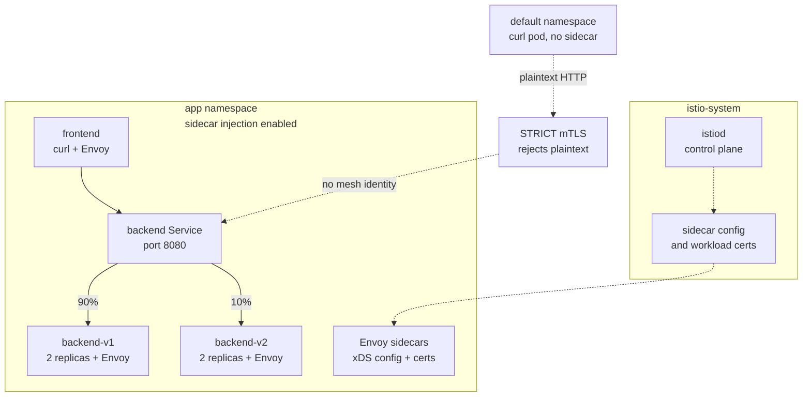

# Mesh Resilience Lab

This lab proves that Istio can enforce STRICT mTLS, shift traffic between service versions, and keep serving during live backend pod termination in a local Kubernetes cluster.

## Architecture



## Quickstart

```bash
git clone https://github.com/<your-user>/mesh-resilience-lab.git
cd mesh-resilience-lab

./scripts/setup.sh
./scripts/verify-mtls.sh
./scripts/traffic-split-check.sh
./scripts/chaos-test.sh
```

To remove the lab cluster:

```bash
./scripts/teardown.sh
```

## Results

| Property tested | Verification method | Result |
| --- | --- | --- |
| Istio control plane | `kubectl get pods -n istio-system` | Conformant |
| Sidecar injection | `kubectl get pods -n app -o wide` | Conformant: app pods were `2/2` Ready |
| STRICT mTLS | Same backend request from outside and inside the mesh | Confirmed: plaintext outside request rejected, in-mesh request succeeded |
| 90/10 traffic split | Count backend responses across 20 frontend requests | 17 responses from v1, 3 from v2 |
| Pod-failure resilience, invalid measurement | Local k6 through `kubectl port-forward` | 68.89% failure, invalidated because the test tunnel broke |
| Pod-failure resilience, valid measurement | k6 Job running inside the mesh with a sidecar | 95.25% success across 2911 requests |

### Chaos Test

The valid resilience run produced **95.25% success across 2911 requests** while backend v1 pods were terminated during active load.

An earlier port-forward-based attempt produced a false **68.89% failure** signal because the test tool broke when the targeted pod disappeared, not because the mesh failed. See [docs/troubleshooting.md](docs/troubleshooting.md) for the full writeup.

## Full Report

The original incident report PDF is available at [report/rapport_incident_service_mesh.pdf](report/rapport_incident_service_mesh.pdf). A GitHub-readable markdown version is in [docs/incident-report.md](docs/incident-report.md).

## Environment

Versions used for the captured report:

| Tool | Version |
| --- | --- |
| kind | v0.31 |
| Kubernetes | v1.35 |
| Istio | 1.30.2 |
| k6 | v2.0.0 |

## License

MIT. See [LICENSE](LICENSE).
