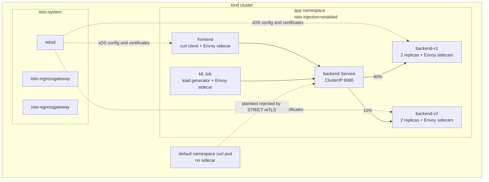

# Architecture

This lab deploys a small two-version service behind Istio so that mesh behavior can be observed directly rather than inferred from YAML.

## What Is Deployed

- `app` namespace with automatic Istio sidecar injection enabled.
- `backend` Kubernetes Service on port `8080`.
- `backend-v1` Deployment with two replicas returning `response from backend v1`.
- `backend-v2` Deployment with two replicas returning `response from backend v2`.
- `frontend` Deployment running `curlimages/curl`, used as an in-mesh client.
- `PeerAuthentication` in `STRICT` mode for namespace-wide mTLS enforcement.
- `DestinationRule` with `v1` and `v2` subsets plus outlier detection.
- `VirtualService` routing `90%` of backend traffic to `v1` and `10%` to `v2`, with retries for transient failures.
- k6 load generation as an in-mesh Kubernetes Job during the chaos test.

## Why These Choices

kind keeps the lab reproducible on a laptop while still exercising real Kubernetes control-plane behavior. Istio's `demo` profile is intentionally heavier than a minimal profile because it exposes the standard control-plane and gateway components someone expects to inspect in a learning lab.

The backend uses two simple `hashicorp/http-echo` versions so response bodies can be counted without adding application code. The frontend is a long-running curl pod because it gives a stable, sidecar-injected client for mTLS and routing checks.

The chaos test runs k6 inside the mesh instead of using `kubectl port-forward`. That distinction matters: port-forward tunnels can be bound to a pod lifecycle, while an in-mesh client talks to the backend service the way a real workload would.
