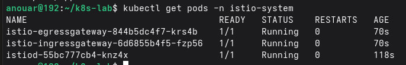
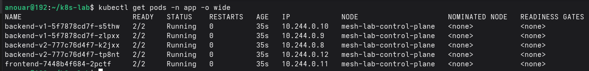
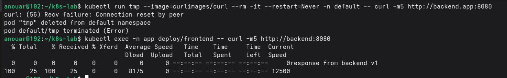
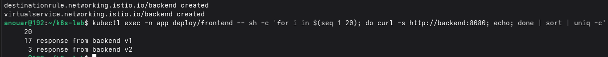
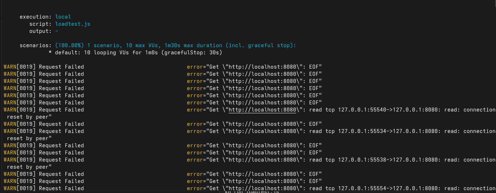
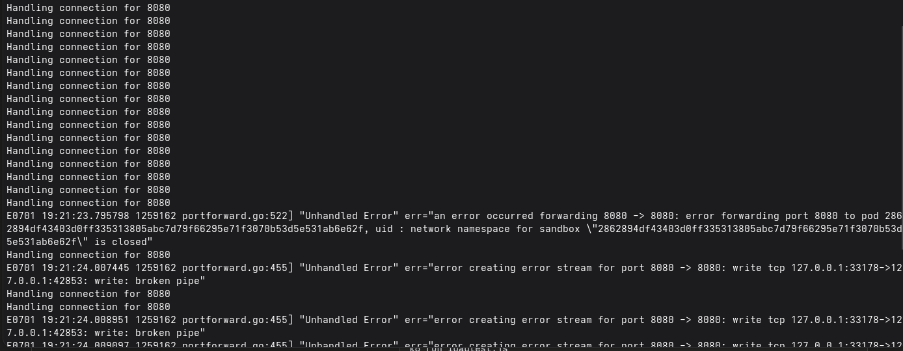
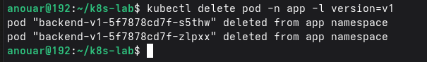
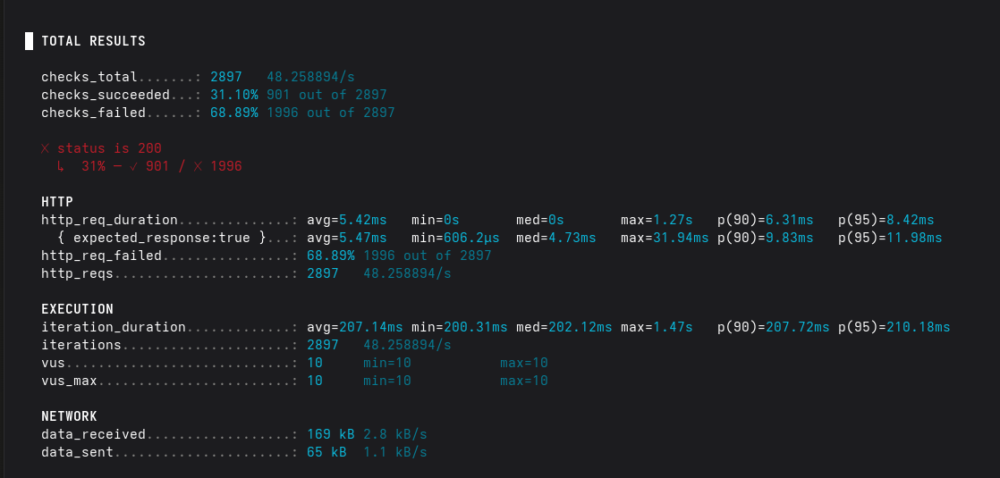
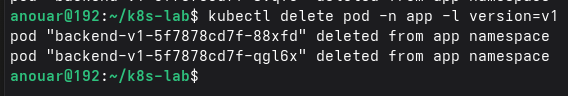
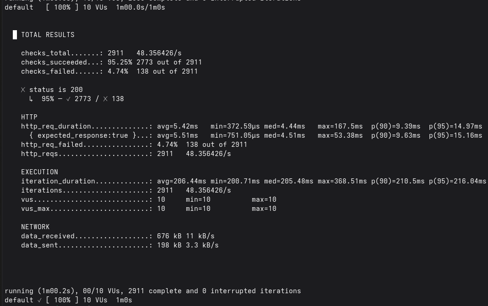

# Incident Report: Service Mesh Resilience Validation

Deployment of Istio on a local Kubernetes kind cluster, validating mTLS, traffic management, and failure tolerance.

Author: Anouar  
Date: July 1, 2026  
Environment: kind v0.31, Kubernetes v1.35, Istio 1.30.2, k6 v2.0.0

## 1. Context

The goal was not to deploy a standard sample app. The goal was to verify three production-relevant service mesh properties with direct evidence:

- automatic encryption and authentication of internal traffic through mTLS;
- controlled traffic distribution between two backend versions;
- real tolerance of backend pod failure while load is active.

The lab treats applied YAML as configuration, not proof. Each property is validated through observed traffic behavior.

## 2. Architecture

The kind cluster hosted the Istio control plane and gateways in `istio-system`, plus an application namespace named `app` with automatic sidecar injection enabled.

The application contains:

- `backend-v1`, two replicas;
- `backend-v2`, two replicas;
- `backend` Service on port `8080`;
- `frontend`, a curl-based in-mesh client pod.



Proof 1: `istiod` and the ingress/egress gateways were Running in `istio-system`.



Proof 2: application pods in `app` showed `2/2` containers Ready, confirming Envoy sidecar injection.

## 3. Environment Bug

Before the mesh validation, kind cluster creation failed. The kubelet on the control-plane node restarted repeatedly, with 290 restart attempts observed, and `kubeadm init` timed out before the node became healthy.

The high-level kubeadm error was misleading. Inspecting kubelet logs with `journalctl` exposed the real cause:

```text
inotify_init: too many open files
```

That failure prevented cAdvisor and certificate watchers from starting correctly. On the Fedora host, `fs.inotify.max_user_instances` was too low for the kind workload. Raising the inotify instance limit with `sysctl` resolved the cluster creation issue.

No screenshot was preserved for the inotify diagnosis, so this section documents the command path and root cause without inventing visual evidence.

## 4. Mesh Deployment

Istio was installed with the demo profile. The application namespace was labeled for injection before deploying the backend and frontend workloads.

The meaningful deployment check was not the namespace label by itself. The proof was that each app pod actually ran with two ready containers: the application container and the Envoy sidecar.

## 5. mTLS Proof

A namespace-wide `PeerAuthentication` policy set mTLS mode to `STRICT`. The test compared two requests to the same backend service:

- a plaintext request from a pod outside the mesh in the `default` namespace;
- a request from the sidecar-injected `frontend` pod inside the `app` namespace.



Proof 3: the outside plaintext request failed with a connection reset, while the in-mesh request succeeded and returned the expected backend response. This proves STRICT mTLS was active on real traffic, not just accepted by the Kubernetes API.

## 6. Traffic Split

A `DestinationRule` defined `v1` and `v2` subsets, and a `VirtualService` routed traffic at `90%` to `v1` and `10%` to `v2`.



Proof 4: across 20 frontend requests, 17 responses came from `backend v1` and 3 came from `backend v2`, which is consistent with the configured 90/10 split at this sample size.

A 50/50 split was also verified interactively, but the capture was not preserved. It is therefore documented as "verified interactively, not captured" rather than presented as evidence.

## 7. Resilience Test Attempt 1 [Invalidated]

The first resilience test ran k6 locally and sent traffic to the backend through `kubectl port-forward`. A `backend-v1` pod was deleted during the test.



Proof 5a: immediately after the pod deletion, k6 reported cascading failures such as EOF and connection reset errors.



Proof 5b: the port-forward logs revealed the real problem. The tunnel itself broke with errors such as `network namespace for sandbox ... is closed` and `broken pipe`.



Proof 5c: backend v1 pod deletion triggered the tunnel failure.



Proof 5d: the final result showed 68.89% failures across 2897 requests. This number was discarded because it measured failure of the test transport, not resilience of the mesh.

## 8. Resilience Test Attempt 2 [Valid]

The corrected test ran k6 as a Kubernetes Job inside the `app` namespace with sidecar injection. k6 called `http://backend:8080` through the internal service DNS name, so the traffic flowed through Envoy and Kubernetes service discovery like normal application traffic.



Proof 6a: backend v1 pods were deleted while the in-mesh k6 test was running.



Proof 6b: the corrected run sent 2911 requests with 2773 successes and 138 failures, producing a 95.25% success rate during pod deletion and replacement.

The residual failures correspond to the normal window where connections drain and failure detection catches up before traffic is fully routed to healthy endpoints.

## 9. Synthesis

| Property tested | Verification method | Result |
| --- | --- | --- |
| Istio control plane | `kubectl get pods -n istio-system` | Conformant |
| Sidecar injection | `kubectl get pods -n app -o wide` | Conformant: `2/2` Ready |
| STRICT mTLS | Request outside and inside the mesh | Confirmed: rejection outside, success inside |
| 90/10 traffic split | Count 20 frontend requests | 17/3 observed |
| Pod-failure resilience, invalid measurement | local k6 + `kubectl port-forward` | 68.89% failure, method invalidated |
| Pod-failure resilience, valid measurement | in-cluster k6 Job with sidecar | 95.25% success across 2911 requests |

## 10. Conclusion

The lab verified the three target properties through direct traffic observations rather than configuration inspection alone.

The most important result is not just the final 95.25% success rate. The important engineering lesson is that the first measurement looked alarming, but investigation showed the measurement tool had failed. Correcting the test method before judging the system was the core value of the exercise.
